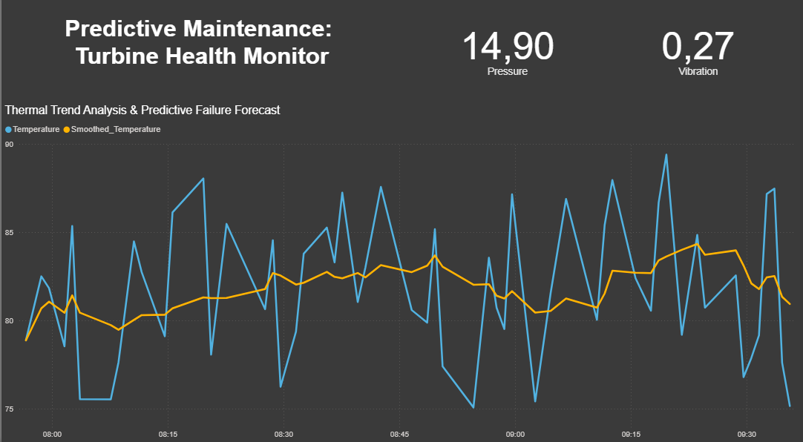
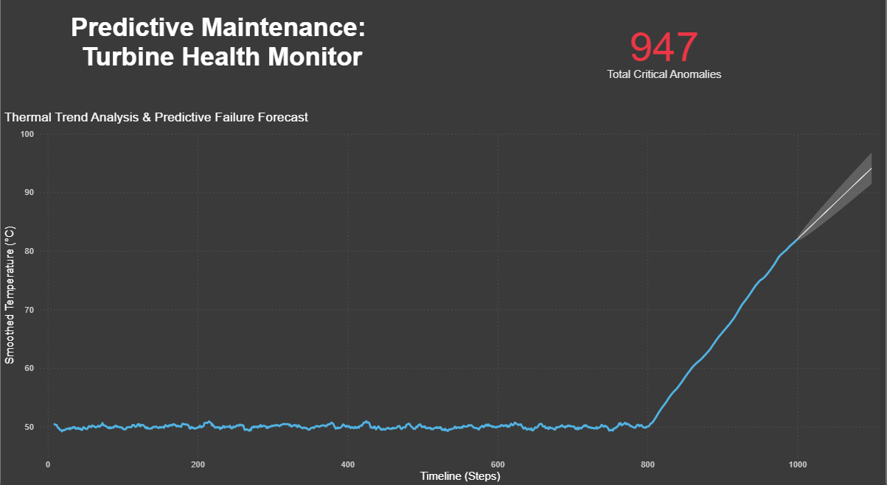

# IoT Turbine Monitoring & Predictive Maintenance Dashboard

This repository documents the technical evolution of an industrial monitoring system. It demonstrates how to transition from static data reporting to a professional, database-driven analytics pipeline.

---

## 🚀 Version 2: SQL-Driven Architecture (Current)
In the second iteration, the project was migrated to a relational database architecture to simulate a real-world industrial IoT environment.

### Technical Highlights:
* **Database Integration:** Migrated the data source from static CSV files to a **SQLite** database connected via **ODBC**.
* **Advanced SQL (Window Functions):** Offloaded data transformation logic from the BI tool to the database. Implemented a 10-row rolling average (`AVG() OVER`) directly in the SQL query to smooth out sensor noise.
* **Dynamic Connectivity:** Integrated a Power BI Parameter (`DB_Path`) to ensure the project remains portable and allows users to easily map their local database location.
* **Advanced Visualization:** Created a dual-line chart to visualize the relationship between raw sensor data and the smoothed trend line for better anomaly detection.

**Dashboard Preview (V2):**

---

## 🛠️ Version 1: The CSV Prototype
The initial phase focused on building the fundamental dashboard layout and understanding the relationship between different sensor metrics.

### Key Features:
* Direct import and cleaning of flat CSV sensor exports.
* Initial visualization of Temperature, Pressure, and Vibration.
* Setup of basic Key Performance Indicators (KPIs) for turbine health.

**Dashboard Preview (V1):**

---

## ⚙️ Setup Instructions
To run this dashboard locally:

1.  **Clone the Repository:** Download the project files.
2.  **Database Connection:**
    * Locate the `turbine_data.db` file in the project folder.
    * Open `Turbine_Monitoring_V2.pbix` in Power BI Desktop.
3.  **Configure Parameters:**
    * Go to **Home > Transform Data > Edit Parameters**.
    * Update the `DB_Path` variable to match the full path on your local machine (e.g., `C:\Users\YourName\Documents\Predictive-Maintenance\turbine_data.db`).
4.  **Refresh:** Click the **Refresh** button to pull live data from the SQLite database.

---

## 📈 Roadmap: The Path to Predictive Maintenance
* **[COMPLETED] V1:** Static CSV reporting.
* **[COMPLETED] V2:** SQL-driven architecture and database-level data smoothing.
* **[NEXT] V3: Machine Learning Integration:** I will implement a **Python-based ML model** to analyze historical sensor data, predict future temperature spikes, and write the predictions back to the SQL database for real-time alerting in Power BI.
